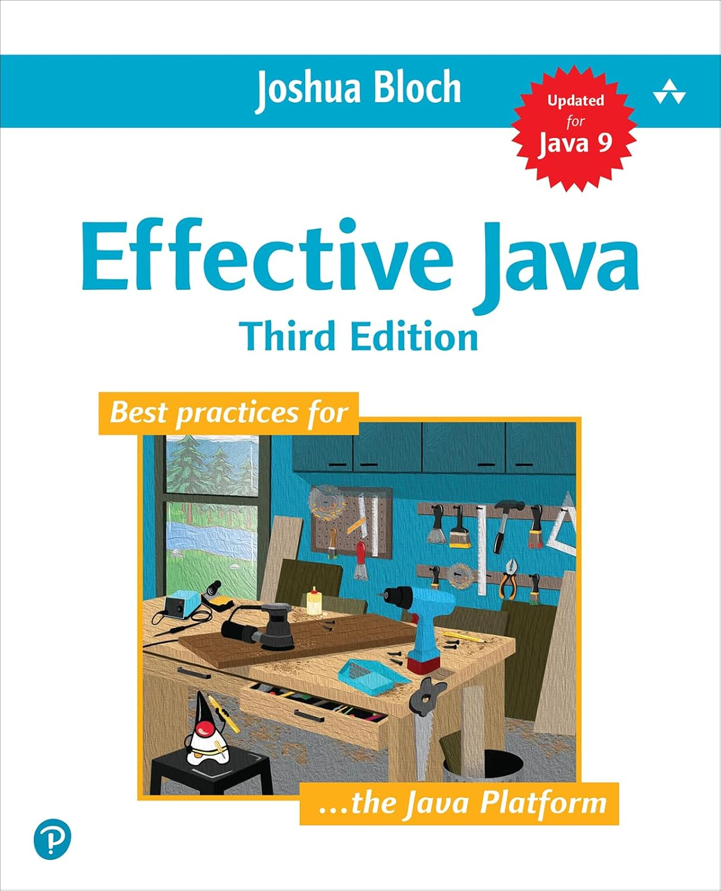
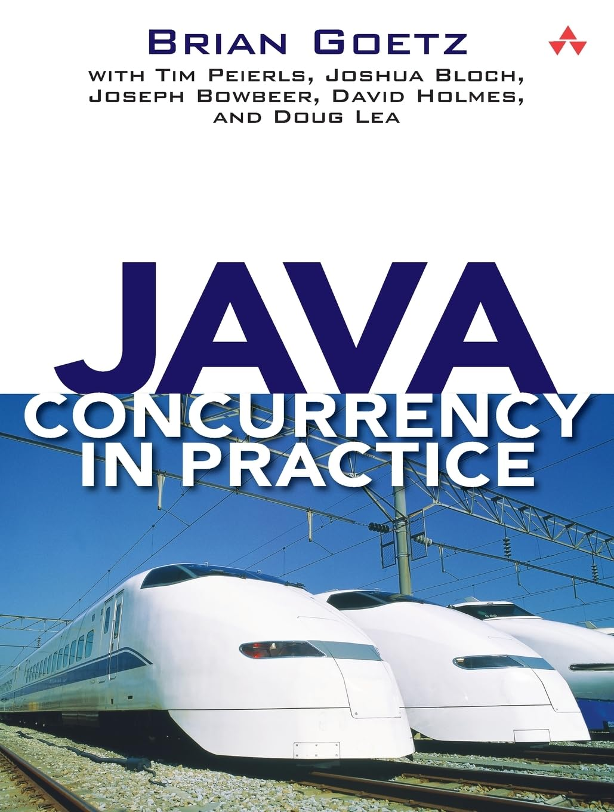
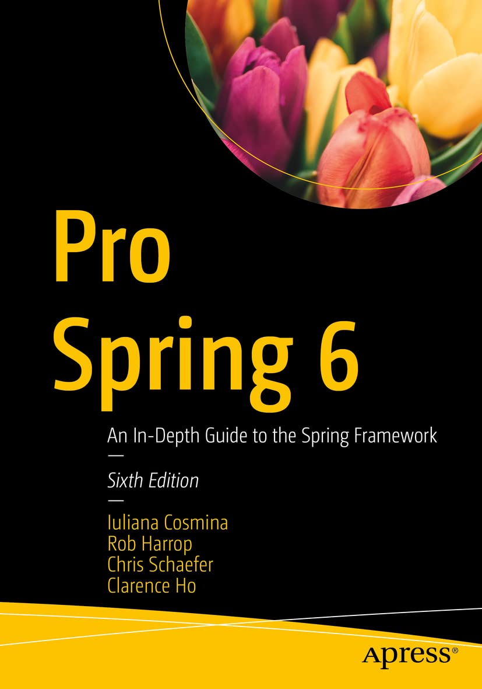
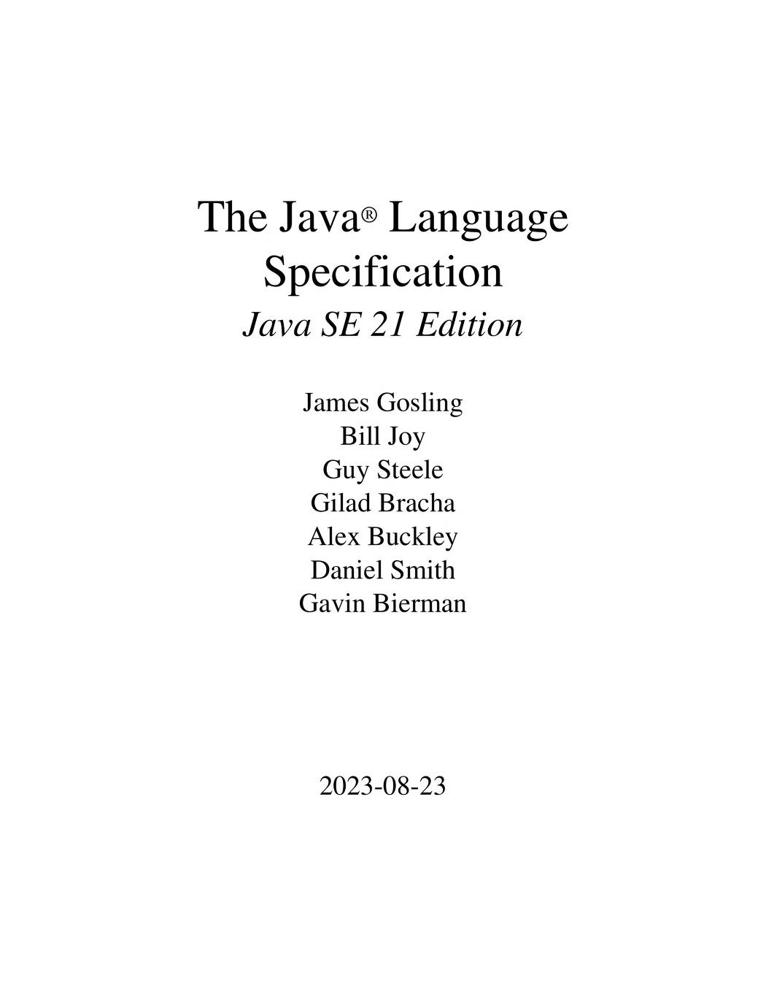
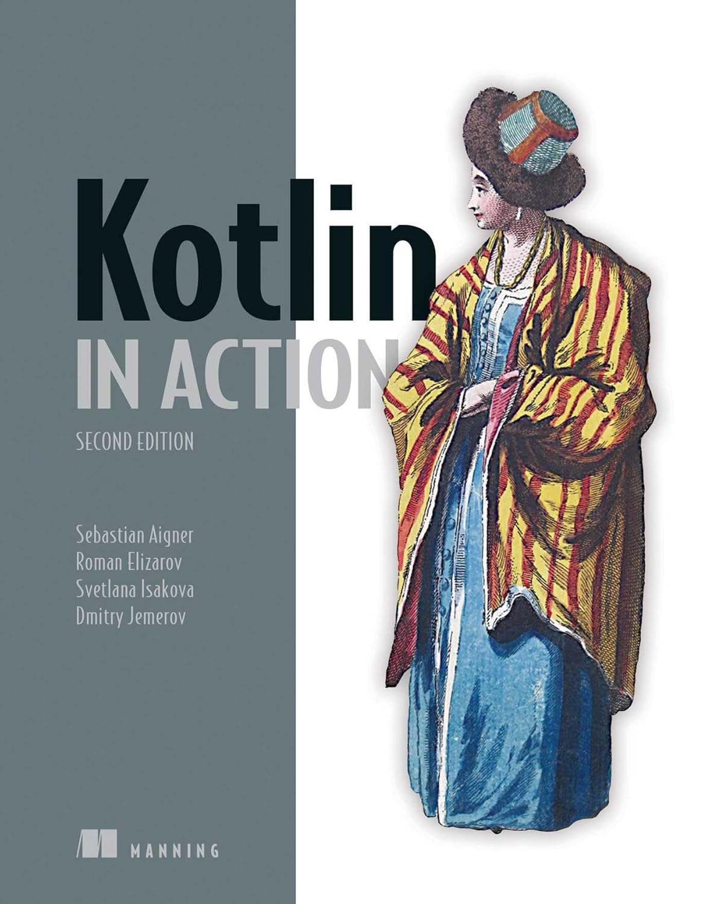
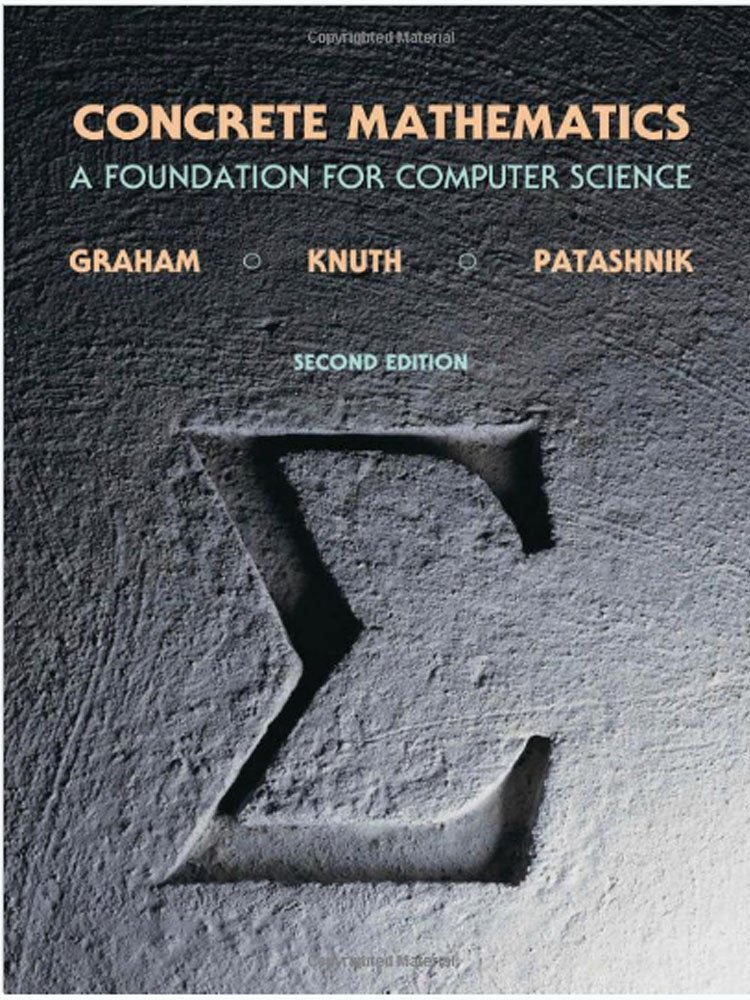

# Hello there! 👋 I'm Arseniy Karmanov

Welcome to my personal website! I'm a passionate Java Developer with a strong inclination towards building robust applications using Java and Spring. I relish the challenge of solving intricate problems and am always eager to learn and improve my skills by staying updated with the latest technologies.

## 🚀 About Me
- 🔭 Currently working as a **Java Developer**
- 💻 Enthusiastic about **Java** and **Spring Framework**
- 🌱 Always eager to learn and explore new technologies
- 🎯 Focused on writing clean, maintainable code and following best practices

## 🛠️ My Tech Stack
Here are some of the technologies I work with:

## 📚 Books and Learning

Completed Books

| Cover                                             | Title                                   | Author          | Description                                            |
| ------------------------------------------------- | --------------------------------------- | --------------- | ------------------------------------------------------ |
|           | **Pro Git**                             | Scott Chacon    | Mastered Git fundamentals and advanced workflows       |
|    | **Effective Java**                      | Joshua Bloch    | Learned best practices for Java development            |
|  | **Java Concurrency in Practice**        | Brian Goetz     | Deep dive into multithreading and concurrency          |
|      | **Pro Spring 6**                        | Iuliana Cosmina | Explored Spring Framework internals and best practices |
|                         | **Java Language Specification (17-21)** | James Gosling   | Studied official language syntax and semantics         |

Currently Reading

| Cover                                                                                    | Title                          | Author           | Progress                            |
| ---------------------------------------------------------------------------------------- | ------------------------------ | ---------------- | ----------------------------------- |
|  | **Introduction to Algorithms** | Thomas H. Cormen | Core algorithms and data structures |
|                                         | **Kotlin in Action**           | Dmitry Jemerov   | Advancing Kotlin proficiency        |
|                                     | **Concrete Mathematics**       | Ronald L. Graham | Mathematical foundations for CS     |

## 📄 Resume
Check out my detailed professional resume [here](/resume).

## 💻 Projects
View my portfolio of projects [here](/projects).

## 📫 Get in Touch
Feel free to reach out to me:
- [GitHub](https://github.com/akarmanov2022)
- [Twitter](https://twitter.com/arseniykarmanov)
- Email: me@akarmanov.me

Thanks for visiting my website! Let's connect and collaborate!
